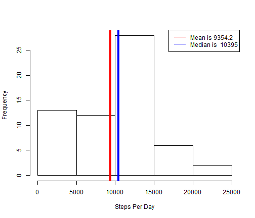
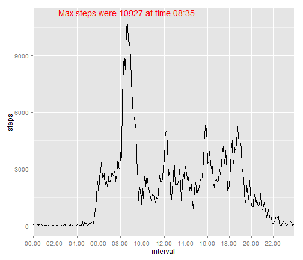
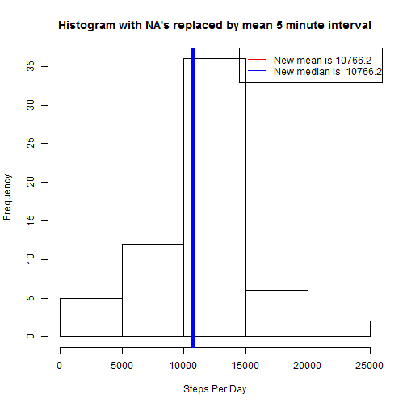
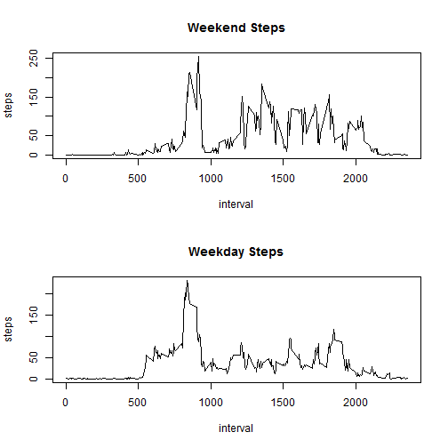

Peer Assignment 1
========================================================
First I loaded the data and created a histogram of average steps per time interval


```r
install.packages("ggplot2")
```

```
## Installing package into 'C:/Users/Teddy/Documents/R/win-library/3.0'
## (as 'lib' is unspecified)
```

```
## Error: trying to use CRAN without setting a mirror
```

```r
library(ggplot2)
activity = read.csv("c:/users/teddy/dropbox/coursera/r courses/workspace/data/activity.csv")
```


The mean and median steps per day are displayed on the chart


```r
stepsPerDay = xtabs(steps ~ date, data = activity)
hist(stepsPerDay, xlab = "Steps Per Day", main = "")
abline(v = mean(stepsPerDay), col = "red", lwd = 4)
abline(v = median(stepsPerDay), col = "blue", lwd = 4)
legend("topright", legend = c(paste("Mean is", round(mean(stepsPerDay), 1)), 
    paste("Median is ", round(median(stepsPerDay), 1))), col = c("red", "blue"), 
    lty = 1)
```

 


Now I create a time series chart with the average number of steps per interval

First I get the average steps per interval

```r
stepsPerInterval = xtabs(steps ~ interval, data = activity)
stepsPerIntervalDF = data.frame(stepsPerInterval)
stepsPerIntervalDF$interval = as.numeric(levels(stepsPerIntervalDF$interval))
names(stepsPerIntervalDF) = c("interval", "steps")
```


Then I get a more readable x-axis

```r
stepsPerIntervalDF$interval = floor(stepsPerIntervalDF$interval/100) * 60 + 
    stepsPerIntervalDF$interval%%100
actualSeconds = stepsPerIntervalDF$interval * 60
unformattedTime = as.POSIXct(actualSeconds, origin = "1970-01-01", tz = "GMT")
formattedTime = format(unformattedTime, format = "%H:%M")
```


Now I plot the data and have with the x-axis having a tick mark every two hours.

```r
specificObs = seq(1, length(stepsPerIntervalDF$interval), 24)
maxIndex = match(max(stepsPerIntervalDF$steps), stepsPerIntervalDF$steps)
```


The interval with maximum steps is plotted on the graph


```r
ggplot(stepsPerIntervalDF, aes(x = interval, y = steps)) + geom_line() + scale_x_discrete(breaks = stepsPerIntervalDF$interval[specificObs], 
    labels = formattedTime[specificObs]) + geom_text(data = stepsPerIntervalDF[maxIndex, 
    ], label = paste("Max steps were", max(stepsPerIntervalDF$steps), "at time", 
    formattedTime[maxIndex]), vjust = -0.45, color = "red")
```

 


The total number of NA's are found

```r
sum(is.na(activity$steps))
```

```
## [1] 2304
```


Each NA value will be replaced by the mean number of steps of its corresponding 5 minute interval.

A new dataset is created

```r
meanPer5MinuteInterval = aggregate(steps ~ interval, data = activity, mean)
activityNoNA = merge(activity, meanPer5MinuteInterval, by.x = "interval", by.y = "interval")
activityNoNA$steps.x[is.na(activityNoNA$steps.x)] = activityNoNA$steps.y[is.na(activityNoNA$steps.x)]

# format and rename column of activityMeanNoNA
activityNoNA = activityNoNA[, 1:3]
names(activityNoNA)[2] = "steps"
```

A new histogram is created for steps per day with all the NA values replaced

```r
# histogram without NA
stepsPerDayNoNA = xtabs(steps ~ date, data = activityNoNA)
hist(stepsPerDayNoNA, xlab = "Steps Per Day", main = "Histogram with NA's replaced by mean 5 minute interval")
abline(v = mean(stepsPerDayNoNA), col = "red", lwd = 4)
abline(v = median(stepsPerDayNoNA), col = "blue", lwd = 4)
legend("topright", legend = c(paste("New mean is", round(mean(stepsPerDayNoNA), 
    1)), paste("New median is ", round(median(stepsPerDayNoNA), 1))), col = c("red", 
    "blue"), lty = 1)
```

 


The mean and median are now both the same due to the large number of NA's. The mean has increased about 10%, while the median has remained relatively unchanged.


For the final chart, each day was categorized as a weekday or a weekend and then a time series graph was plottted comparing the two

```r
# get type of day
dayType = data.frame(day = c("Monday", "Tuesday", "Wednesday", "Thursday", "Friday", 
    "Saturday", "sunday"), type = c("weekday", "weekday", "weekday", "weekday", 
    "weekday", "weekend", "weekend"))
activityNoNA$weekday = weekdays(as.Date(activityNoNA$date))
activityDay = merge(activityNoNA, dayType, by.x = "weekday", by.y = "day")
weekdayStepsPerInterval = aggregate(steps ~ interval, data = activityDay[activityDay$type == 
    "weekday", ], mean)
weekendStepsPerInterval = aggregate(steps ~ interval, data = activityDay[activityDay$type == 
    "weekend", ], mean)
par(mfrow = c(2, 1))
with(weekendStepsPerInterval, plot(interval, steps, type = "l", main = "Weekend Steps"))
with(weekdayStepsPerInterval, plot(interval, steps, type = "l", main = "Weekday Steps"))
```

 

It appears that during the weekend this person started their day later and ended it earlier. This is seen by the number of steps starting later in the day with more steps being taken later in the day. It also looks like there were more overall steps taken during the afternoon during weekends. The peak number of steps for both weekends and weekdays seemed to coincide around 9 a.m.
